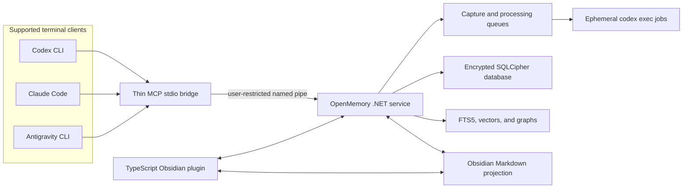

# OpenMemory Architecture

> **Status:** approved planning baseline. No application code exists yet, and none of the components described here should be read as implemented or tested.

OpenMemory is a personal, local-first memory service for Windows 11. It gives Codex, Claude Code, and Google Antigravity a common memory without making any one client the owner of that memory. Obsidian is the main human-facing interface, but the service remains usable when Obsidian is closed or not installed.

The [product requirements](PRODUCT_REQUIREMENTS.md) define expected behavior. The [data and privacy design](DATA_AND_PRIVACY.md) defines authority, retention, secrets, and consent. This document defines the planned technical boundaries.

## System shape

There are four deployment units:

1. A per-user C# service on .NET 10, delivered through an MSI installer, owns durable state, indexing, queues, and policy enforcement.
2. A small MCP server communicates over standard input/output with each terminal client and forwards neutral requests to the service.
3. Client-specific capture adapters, hooks, and resumable importers translate Codex, Claude Code, and Antigravity activity into the same event contract.
4. A TypeScript Obsidian plugin presents search, history, temporal relationships, conflicts, warnings, and health while projecting selected durable knowledge into Markdown.

The service is a singleton for the signed-in Windows user. It exposes no listening network port. Local processes connect through a named pipe whose access-control list permits only that user and the OpenMemory installation. Each installed adapter is also registered with a stable client identity and capability set; the service rejects unregistered clients and operations outside the registered capabilities. The exact credential and process-binding mechanism is fixed by the Stage 0 threat model and then proved against same-user impersonation. The MCP bridge contains no memory logic and must not become a second source of truth.

## Security and trust boundaries

OpenMemory treats terminal clients, imported histories, repositories, attachments, Markdown, and model output as untrusted inputs. Text from those sources is evidence, never an instruction to the service. Only the policy layer may authorize writes, promotions, deletion, repair, export, or update actions.

The important boundaries are:

- **Client to bridge:** MCP requests are parsed against a versioned schema and bounded before forwarding.
- **Bridge to service:** the named pipe authenticates the Windows user and registered client capability, limits message sizes, rejects unsupported protocol versions or capabilities, and records auditable reads and writes. Same-user pipe access is not treated as human approval.
- **Input to persistence:** deterministic secret scanning and normalization happen before raw content, derived text, embeddings, logs, or exports can be written.
- **Model processing:** recurring `codex exec` work begins only after setup opt-in and stops when consent is revoked. Only the minimum redacted evidence required for a job may be passed. Model output is provisional until deterministic validation and memory authority rules are applied.
- **Database to vault:** only approved projections leave encrypted storage. Raw conversations, tool outputs, private provenance, secret findings, and internal audit material do not become ordinary Markdown.
- **Local system to network:** no telemetry is planned. Network use is limited to consented Codex processing and update checks whose installation requires a signature or signed attestation anchored to a pinned project identity; checksums provide integrity only.

Security-sensitive operations fail closed. If secret scanning, key access, authorization, or schema validation is unavailable, the affected item remains quarantined or queued rather than being persisted or transmitted unsafely.

## Durable storage and keys

The encrypted SQLCipher database is the authoritative machine store. It contains the append-only capture journal, normalized events, raw evidence, temporal claims, project state, code and Git graphs, retrieval indexes, processing jobs, conflicts, feedback, audit records, and backup metadata.

The database uses a single-writer design. Producers append to a durable local journal or submit commands to the service; one ordered writer validates and commits them. Each event has a stable identifier, source identifier, content hash, schema version, capture time, and processing status. Replayed events are idempotent, so a crash between capture and acknowledgement does not duplicate memory.

The encryption key is generated locally. Windows Credential Manager stores the protected key material, with DPAPI binding it to the Windows user. The user receives a separately protected recovery-key workflow for migration or credential loss. OpenMemory never stores the database key beside the database in plaintext. Recovery attempts are rate-limited and audited; losing both Windows-protected key material and the recovery key makes encrypted data unrecoverable by design.

Schema migrations are transactional, versioned, and preceded by a restorable backup. Startup refuses unsafe downgrades or partially applied migrations and offers repair or rollback rather than guessing.

## Capture and normalized events

Each supported client has two complementary paths:

- Hooks capture new lifecycle events with low latency.
- Importers scan supported local history to reconcile events that hooks missed, including after downtime or allowance exhaustion.

Both emit a provider-neutral event envelope. Common event types include conversation turns, tool calls, tool results, attachments, task transitions, repository observations, explicit stores, and feedback. Memory records and graph nodes never use provider branding as semantic labels.

Encrypted private provenance preserves the adapter name, original record ID, source location, timestamps, and integrity hash. It exists only for deduplication, evidence tracing, repair, and audit. User-visible memory remains neutral unless the user explicitly asks to inspect provenance.

Automatic capture always preserves complete redacted evidence and runs a bounded routine extraction. An inline `/store` targets the complete turn after the associated assistant and tool activity finishes; a standalone `/store` targets the preceding complete turn. The command applies a richer extraction schema and larger extraction budget and bypasses the ordinary quiet period. The richer pass explicitly seeks goal changes, decisions, requirements, constraints, rationale, task state, project-relevant user preferences, artifacts and evidence, lessons, and open questions. It does not raise the resulting claims' authority or bypass secret scanning, authority rules, conflict review, or validation. Ordinary work waits for one hour of inactivity, and a daily 2:00 AM local catch-up processes anything left behind.

## MCP interface contract

The provider-neutral MCP surface is versioned independently from client adapters. Supported terminal clients receive the same tool names and schemas; source-client identity is retained only in encrypted private provenance.

Read tools are silently available without per-query approval, subject to project sensitivity and audit rules:

| Tool | Contract |
|---|---|
| `memory_context` | Return a compact task-aware context packet with citations and ranking metadata. |
| `memory_search` | Run bounded hybrid search with project, time, authority, sensitivity, type, and mode filters. |
| `memory_get` | Retrieve an exact authorized memory record or its redacted supporting evidence by stable ID. |
| `memory_status` | Report service, project, capture queue, processing queue, index, backup, and health state without exposing secrets. |

Controlled write and workflow tools are:

| Tool | Contract |
|---|---|
| `memory_store` | Submit a stable complete-turn ID, or deliberately supplied standalone text, for immediate richer extraction; the slash-command adapter resolves inline and standalone `/store` forms to complete-turn IDs. |
| `memory_feedback` | Record explicit user or model outcome feedback without rewriting the underlying evidence. |
| `memory_project` | Inspect or select the active project and propose sensitivity changes; lowering sensitivity or widening disclosure requires trusted local human confirmation. |
| `memory_review` | List review items and submit proposed resolutions; protected resolutions are finalized only through the trusted local confirmation channel. |

Read access does not mean unrestricted disclosure: the service still applies client capabilities, authorization, sensitivity, redaction, and bounded-result policies. Write tools validate schemas and permissions, append audit records, and route approval-requiring changes to review. A model or MCP call can never mint approval. The trusted terminal UI or Obsidian UI displays the exact action and creates a short-lived, action-bound, single-use confirmation that the service consumes atomically; the Stage 0 threat model must specify the user-presence mechanism and resistance to same-user process spoofing. Human-facing aliases such as `/store` and `/memory`, plus the `openmemory` CLI, call these same service contracts rather than maintaining separate behavior.

## Processing and memory authority

Processing jobs are durable and resumable. After the user opts in, a scheduler leases bounded jobs to ephemeral `codex exec` processes for extraction, summarization, reflection, and report drafting. Jobs include only redacted, relevant evidence and a versioned output schema. Consent revocation, authentication failure, allowance exhaustion, cancellation, or invalid output returns the job to a paused or retryable state without losing captured evidence or stopping local capture and retrieval.

Model output cannot directly overwrite approved memory. It submits claims with evidence and a proposed authority state. The policy engine applies the approved rules:

- raw evidence remains immutable;
- automatically derived facts begin as provisional;
- explicit user edits and approved facts have greater authority;
- a first promotion into global memory requires approval;
- compatible later refinements may be applied automatically;
- genuine conflicts display before and after values plus supporting context for approval;
- superseded facts remain queryable instead of being deleted.

Project sensitivity controls cross-project retrieval: normal projects may share approved summaries, restricted projects ask before sharing, and isolated projects do not share.

## Bitemporal knowledge graph

The graph lives inside SQLCipher rather than a separate graph database. Nodes represent entities, claims, projects, tasks, artifacts, code symbols, commits, attempts, and evidence. Edges represent typed, versioned relationships with provenance.

Every historical claim supports two time dimensions:

- **Valid time:** when the claim was true in the described world.
- **Recorded time:** when OpenMemory learned, changed, or superseded it.

This bitemporal model answers both “what was believed on that date?” and “what do we now know was true on that date?” A clear transition can close the previous valid-time interval automatically. Ambiguous identity, overlapping facts, or incompatible high-authority claims enter review. Provisional reflections may collect supporting and opposing evidence but cannot silently override approved memory.

Failed attempts are first-class records connected to goals, actions, artifacts, outcomes, and lessons. Retrieval can warn before a similar operation without treating an old failure as a permanent prohibition.

## Retrieval

Retrieval combines several independent signals:

- SQLite FTS5 for exact terms and keyword ranking;
- local ONNX embeddings for semantic similarity;
- structured filters for project, task, time, authority, sensitivity, and memory type;
- temporal and knowledge-graph proximity;
- outcome feedback, with explicit user feedback weighted above model feedback;
- non-destructive relevance decay that never deletes evidence or protected memories.

A versioned ranking contract fuses the signals into a bounded context packet. The service chooses a task-aware mode automatically, while MCP commands permit an explicit mode override. A small packet may be prefetched silently before a model turn; clients can request deeper evidence when needed. Every read records query purpose, selected record IDs, ranking version, and destination without logging secret content.

Embeddings are produced locally. They support search only and cannot generate text. Core, pinned, approved, recently used, and conflict-relevant records are protected from ordinary decay.

## Code intelligence and Git

Tree-sitter parsers build a structural code graph for C#, TypeScript, JavaScript, Python, Rust, Go, Java, C, C++, HTML, CSS, SQL, and PowerShell. The graph stores symbols, definitions, references, imports, calls, inheritance, files, parse versions, and evidence links. File and Git events trigger throttled incremental updates instead of complete rescans.

Git history is indexed structurally: repositories, commits, branches, worktrees, changed symbols, and relevant relationships are retained. OpenMemory does not duplicate every full diff when Git already preserves it. Branches and worktrees share durable project knowledge but keep distinct live task state and code-graph views. Each repository and worktree has a stable internal identity, so moving a folder does not create a second project.

When code contradicts a recorded architectural or behavioral fact, OpenMemory marks the memory as possibly stale and attaches opposing evidence. It does not rewrite approved memory automatically.

## Obsidian projection

The vault is a human-readable projection, not the sole database. It contains a global index, project indexes, current task snapshots, approved memories, requirements, decisions, architecture, artifacts, lessons, playbooks, open questions, relevant user preferences, and generated reports.

Projected notes contain stable opaque IDs and projection versions. When a user edits a managed note, the plugin or watcher submits a versioned change to the service. The service compares the edit with the last projected version, applies authority and conflict rules, commits the accepted change, then regenerates the projection. Concurrent database and Markdown changes produce a review item rather than last-writer-wins data loss.

The TypeScript plugin provides read-focused views for encrypted transcript evidence, temporal graph exploration, hybrid search, conflicts, ambiguous entities, secret warnings, deletion review, and service health. Editing the graph canvas is outside v1. Terminal MCP and CLI commands remain functional without Obsidian.

The plugin is sideloaded for development and private beta. After privacy, compatibility, and user-path gates pass, the public v1 plugin is submitted to Obsidian's community plugin directory. The exact submission date depends on that external review, but community submission—not permanent sideloading—is the approved distribution target.

The private data directory and vault each receive a stable installation identifier and reciprocal manifest containing the other location. If a sync-managed folder is detected, encrypted private data stays outside it. The user may allow the plaintext vault to sync only after a warning.

## Operations

- **Backups:** encrypted routine backups rotate automatically; manually pinned backups never expire. Backups include schema and integrity metadata and are tested through restore drills.
- **Portable export:** an explicit export can produce Markdown, JSONL, attachments, graph data, and checksums. Because this may be plaintext, OpenMemory shows a clear warning and requires confirmation.
- **Migration:** supported client histories, approved old vault material, manual files, and Git repositories enter as untrusted evidence. Import is resumable and reports coverage and failures.
- **Deletion:** no raw evidence is automatically deleted. A deletion review lists secret type or field name and location, never the value. Destructive actions require an exact target list and approval.
- **Doctor:** deterministic checks can repair verified OpenMemory-owned registrations after recording before/after state and creating a backup. Ambiguous or security-sensitive changes require approval.
- **Updates:** the service may check GitHub for releases. Patch and minor auto-installation requires a signature or signed attestation anchored to a pinned trusted project identity; checksums are an additional integrity check, not authentication. Backup, health checks, and automatic rollback are mandatory. Major, permission-changing, or irreversible updates require approval.
- **Notifications:** Windows notifications are reserved for urgent conditions such as blocked security review, unrecoverable queue failure, restore failure, or an update rollback.

## Expected failure modes

| Failure | Required behavior |
|---|---|
| Service stops during capture | Journal survives; replay is idempotent; client work continues without memory injection. |
| Database is locked or corrupt | Stop writes, preserve evidence, run integrity diagnostics, and offer verified restore or repair. |
| Credential Manager or DPAPI access fails | Do not open or replace the database; offer recovery-key flow. |
| Codex is signed out or allowance is exhausted | Pause model-dependent jobs; keep capturing locally; `/store` remains prioritized. |
| Model returns invalid or injected output | Reject or quarantine it; preserve source evidence and diagnostic metadata. |
| Named-pipe caller is unauthorized | Reject before reading a payload and record a security event. |
| An importer sees partial or duplicate history | Resume from checkpoints and deduplicate by stable source identity and content hash. |
| Vault and database change concurrently | Create a three-way review; never silently overwrite either version. |
| Parser cannot understand a file | Preserve the file observation, mark the graph partial, and continue indexing other files. |
| Update or migration health check fails | Roll back binaries/schema from the pre-change backup and notify the user. |
| Sync folder is detected | Keep private storage outside sync and warn before projecting plaintext into it. |
| Recovery key is also lost | Explain that encrypted data cannot be recovered; never create a replacement database over it. |

Implementation order, ownership, and proof gates are defined in the [implementation plan](IMPLEMENTATION_PLAN.md). Public release timing is defined in the [roadmap](ROADMAP.md).
